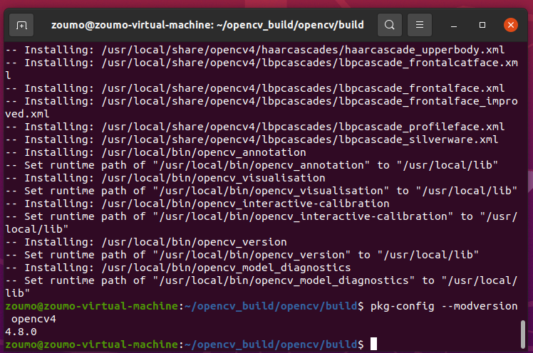
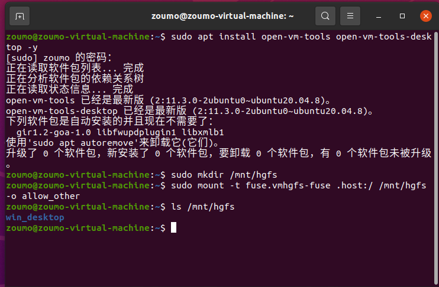
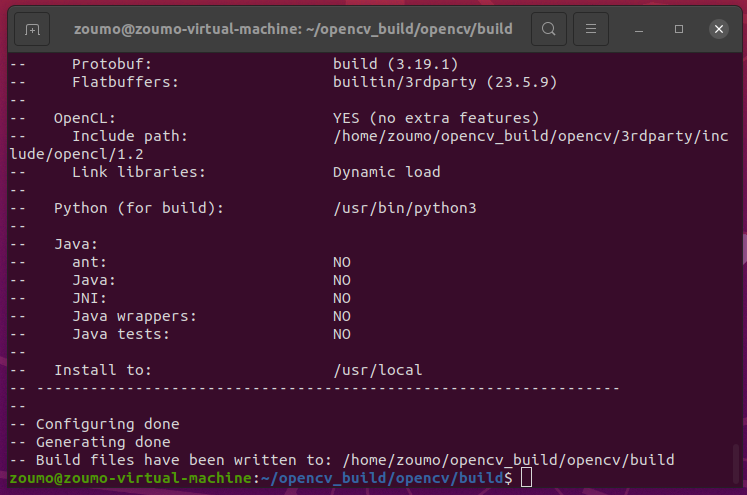
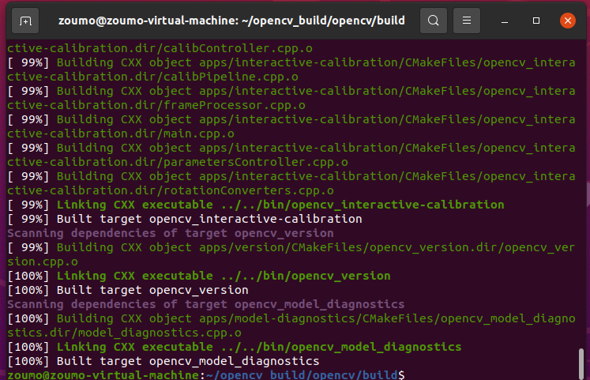
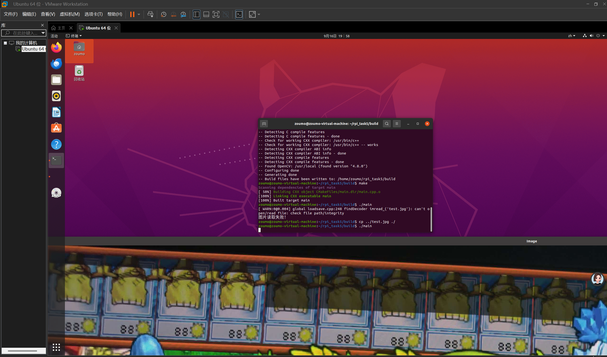

# Task5：学习使用源码编译安装 OpenCV（C++）

## 一、任务目标

本任务的目标是通过源码编译并安装 OpenCV，并在安装完成后编写一个小的 C++ 项目，通过 OpenCV 的库函数读取并显示一张图片，最后结合 CMake 编译生成可执行文件。

通过本任务，我完成了以下内容：

1. 在 Ubuntu 20.04 下通过源码编译安装 OpenCV 4.8.0；
2. 验证 OpenCV 安装是否成功；
3. 编写 C++ 源代码 `main.cpp`，使用 OpenCV 读取、缩放并显示图片；
4. 编写 `CMakeLists.txt`，配置 OpenCV 头文件和库文件；
5. 使用 `cmake` 和 `make` 编译生成可执行文件；
6. 运行程序并显示图片；
7. 记录安装、编译和运行过程中的截图。

---

## 二、实验环境

- 操作系统：Ubuntu 20.04
- OpenCV 版本：OpenCV 4.8.0
- 编程语言：C++
- 构建工具：CMake
- 编译器：GNU g++
- 项目路径：`~/rpi_task/task5_opencv`
- 构建目录：`~/rpi_task/task5_opencv/build`
- 可执行文件：`main`
- 测试图片：`test.jpg`

---

## 三、OpenCV 源码编译与安装简要记录

本任务要求使用源码编译安装 OpenCV。主要流程如下：

1. 安装编译 OpenCV 所需的依赖库；
2. 从 OpenCV 官方仓库下载指定版本源码；
3. 创建 `build` 目录；
4. 使用 `cmake` 配置编译选项；
5. 使用 `make -j` 进行编译；
6. 使用 `sudo make install` 安装；
7. 执行 `sudo ldconfig` 更新动态链接库缓存；
8. 使用命令验证 OpenCV 是否安装成功。

安装完成后，可以通过以下命令查看 OpenCV 版本：

```bash
pkg-config --modversion opencv4
```

安装验证截图如下：



从截图中可以看到，OpenCV 已经成功安装，并且可以通过 `pkg-config` 查询到版本信息。

另外，为了在虚拟机和宿主机之间传输测试图片，我使用了共享文件夹。挂载情况如下图所示：



---

## 四、项目目录结构

项目目录结构如下：

```text
task5_opencv/
├── CMakeLists.txt
├── main.cpp
├── test.jpg
├── build/
│   ├── CMakeFiles/
│   ├── Makefile
│   └── main
└── images/
    ├── opencv_install_verify.png
    ├── shre_mount.png
    ├── opencv_cmake_build.png
    ├── opencv_make_build.png
    └── demo_show_img.png
```

其中：

- `main.cpp`：OpenCV 图像读取与显示程序；
- `CMakeLists.txt`：CMake 构建配置文件；
- `test.jpg`：用于测试显示的图片；
- `build/`：构建目录，用于存放 CMake 和 Make 生成的中间文件及可执行文件；
- `images/`：存放本任务运行过程截图。

---

## 五、实验源码 main.cpp

```cpp
#include <opencv2/opencv.hpp>
#include <iostream>

using namespace cv;
using namespace std;

int main()
{
    Mat img = imread("test.jpg");
    if (img.empty())
    {
        cout << "图片读取失败！" << endl;
        return -1;
    }

    resize(img, img, Size(800, 600));
    imshow("image", img);
    waitKey(0);
    destroyAllWindows();

    return 0;
}
```

### 代码说明

1. `#include <opencv2/opencv.hpp>`  
   引入 OpenCV 的核心头文件。

2. `Mat img = imread("test.jpg");`  
   使用 `imread` 读取当前工作目录下的 `test.jpg` 图片，返回值是 `Mat` 类型。

3. `if (img.empty())`  
   判断图片是否读取成功。如果读取失败，输出提示并返回 `-1`。

4. `resize(img, img, Size(800, 600));`  
   将图片缩放到 800×600 大小，防止图片窗口过大。

5. `imshow("image", img);`  
   创建一个名为 `image` 的窗口，并显示图片。

6. `waitKey(0);`  
   等待用户按键。参数为 0 表示无限等待，直到用户按下任意键。

7. `destroyAllWindows();`  
   关闭所有 OpenCV 创建的窗口。

---

## 六、CMakeLists.txt

```cmake
cmake_minimum_required(VERSION 3.10)

project(opencv_demo)

set(CMAKE_CXX_STANDARD 11)

find_package(OpenCV REQUIRED)

include_directories(${OpenCV_INCLUDE_DIRS})

add_executable(main main.cpp)

target_link_libraries(main ${OpenCV_LIBS})
```

### CMakeLists 说明

1. `cmake_minimum_required(VERSION 3.10)`  
   声明 CMake 最低版本要求。

2. `project(opencv_demo)`  
   声明项目名称为 `opencv_demo`。

3. `set(CMAKE_CXX_STANDARD 11)`  
   设置 C++ 标准为 C++11。

4. `find_package(OpenCV REQUIRED)`  
   查找系统中安装的 OpenCV。如果找不到，CMake 会报错。

5. `include_directories(${OpenCV_INCLUDE_DIRS})`  
   将 OpenCV 的头文件目录加入编译器的头文件搜索路径。

6. `add_executable(main main.cpp)`  
   使用 `main.cpp` 生成名为 `main` 的可执行文件。

7. `target_link_libraries(main ${OpenCV_LIBS})`  
   将 OpenCV 的库文件链接到 `main` 可执行文件。

---

## 七、编译与运行步骤

在终端中进入项目目录，并执行以下命令：

```bash
cd ~/rpi_task/task5_opencv
mkdir -p build
cd build
cmake ..
make
./main
```

命令说明：

1. `cd ~/rpi_task/task5_opencv`：进入项目根目录；
2. `mkdir -p build`：创建构建目录；
3. `cd build`：进入构建目录；
4. `cmake ..`：根据上一级目录中的 `CMakeLists.txt` 生成构建文件；
5. `make`：编译项目并生成可执行文件 `main`；
6. `./main`：运行程序。

---

## 八、运行效果截图

### 1. CMake 配置成功

执行 `cmake ..` 后，CMake 成功找到 OpenCV，并生成构建文件。



从截图中可以看到：

- OpenCV 已被 CMake 找到；
- C++ 编译器配置正常；
- 构建文件生成成功。

---

### 2. make 编译成功

执行 `make` 后，项目成功编译并链接生成可执行文件 `main`。



从截图中可以看到：

- 正在编译 `main.cpp`；
- 正在链接 OpenCV 相关库；
- 最终生成可执行文件 `main`。

---

### 3. 运行程序并显示图片

执行 `./main` 后，程序成功读取 `test.jpg`，并弹出窗口显示图片。



程序运行效果：

- 成功读取 `test.jpg`；
- 图片被缩放到 800×600；
- 弹出窗口显示图像；
- 按下按键后关闭窗口。

---

## 九、实现过程详解

本任务的核心是使用 OpenCV 完成图像读取与显示，并通过 CMake 管理项目构建。

### 1. 图片读取路径问题

程序中使用了相对路径：

```cpp
Mat img = imread("test.jpg");
```

相对路径是相对于程序运行时的当前工作目录，而不是源代码目录。

在本任务中，我是在 `build` 目录下执行：

```bash
./main
```

因此，`test.jpg` 需要放在 `build` 目录下，或者程序中使用绝对路径，例如：

```cpp
Mat img = imread("/home/zoumo/rpi_task/task5_opencv/test.jpg");
```

如果图片读取失败，程序会输出：

```text
图片读取失败！
```

这说明 OpenCV 没有找到图片文件。

### 2. 图片缩放

使用：

```cpp
resize(img, img, Size(800, 600));
```

将图片缩放到 800×600。这样做可以防止图片过大导致窗口超出屏幕。

需要注意的是，如果原图比例不是 4:3，强制缩放到 800×600 可能会导致图片变形。如果希望保持比例，可以使用 `cv::resize` 时只指定宽度或高度，并计算另一边的长度。

### 3. CMake 链接 OpenCV

CMake 中最重要的两行是：

```cmake
find_package(OpenCV REQUIRED)
target_link_libraries(main ${OpenCV_LIBS})
```

`find_package` 负责查找 OpenCV 的安装路径、头文件目录和库文件目录。  
`target_link_libraries` 负责将 OpenCV 的库链接到可执行文件。

如果没有正确链接 OpenCV，编译时会出现类似下面的错误：

```text
undefined reference to `cv::imread(...)`
```

---

## 十、遇到的问题与解决

### 1. 图片读取失败

原因：可执行文件运行时的工作目录中没有 `test.jpg`。

解决方法：

- 将 `test.jpg` 复制到 `build` 目录；
- 或者在代码中使用绝对路径；
- 或者在 `build` 目录中使用相对路径 `../test.jpg`。

### 2. CMake 找不到 OpenCV

原因：OpenCV 没有正确安装，或者系统没有更新动态链接库缓存。

解决方法：

- 确认 OpenCV 已经执行 `sudo make install`；
- 执行 `sudo ldconfig`；
- 使用 `pkg-config --modversion opencv4` 验证；
- 检查 `CMakeLists.txt` 中是否写了 `find_package(OpenCV REQUIRED)`。

### 3. 无法弹出图像窗口

原因：如果在没有图形界面的终端或远程 SSH 中运行，OpenCV 无法创建窗口。

解决方法：

- 在 Ubuntu 图形界面中运行；
- 或者使用 VSCode 的图形终端；
- 或者改用 `imwrite` 保存处理后的图片。

---

## 十一、实验总结

本次实验完成了 OpenCV 的源码编译安装，并使用 C++ 和 CMake 编写了一个简单的图像读取与显示程序。

通过本任务，我掌握了：

1. 如何在 Ubuntu 下通过源码编译安装 OpenCV；
2. 如何验证 OpenCV 是否安装成功；
3. 如何使用 `imread` 读取图片；
4. 如何使用 `imshow` 显示图片；
5. 如何使用 `resize` 缩放图片；
6. 如何使用 `waitKey` 等待按键；
7. 如何在 CMake 中查找并链接 OpenCV；
8. 如何处理图片路径、库链接等常见问题。

最终程序成功运行，并显示了指定图片，达到了 Task5 的要求。