# Task1 Linux Shell学习报告
姓名：邹墨
邮箱：mozhibubai@qq.com
## 一、学习目标
熟悉Linux基础Shell命令，掌握文件操作、目录切换、管道、重定向等基础操作，理解命令行工作方式，完成实验练习。
## 二、命令学习与实验截图
### 2.1 ls 命令
```bash
ls
``` 
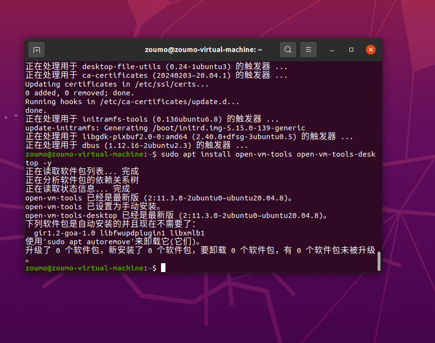
### 2.2 cd 命令
```bash
cd shell_demo
```
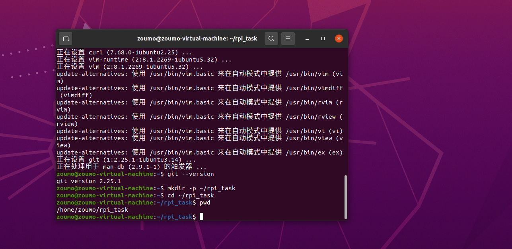
### 2.3 文件查看 cat 命令
```bash
cat test.txt
```
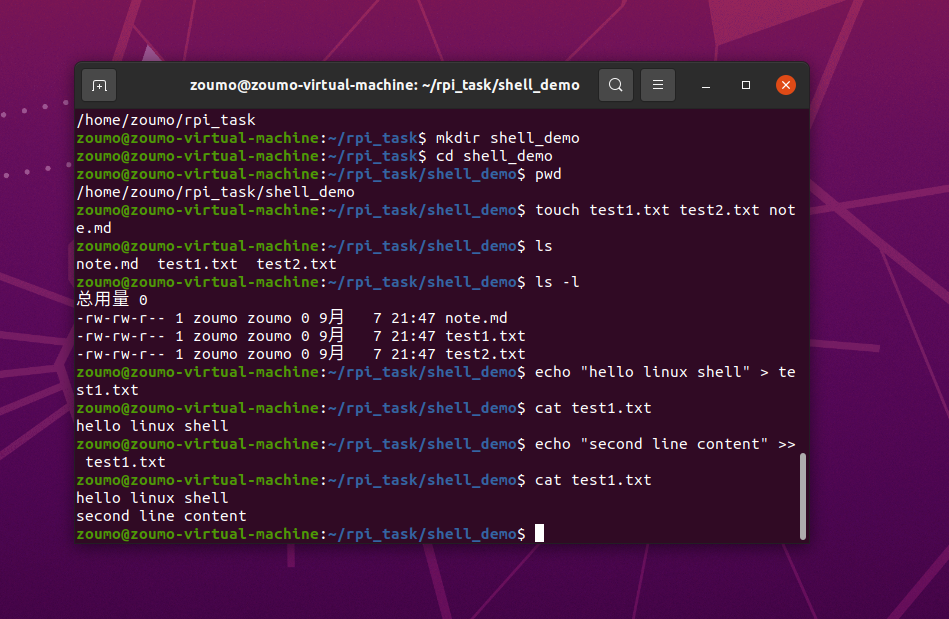
### 2.4 echo 输出与写入文件
```bash
echo "hello" > test.txt
```
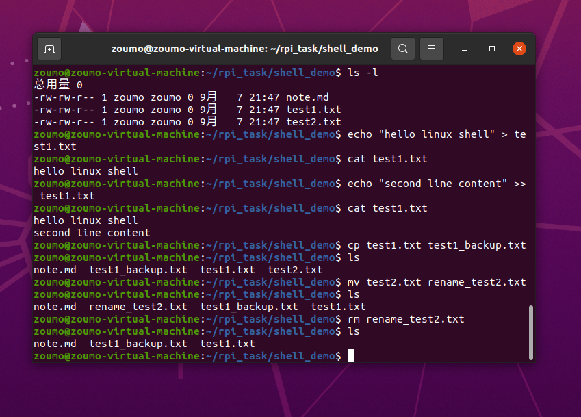
### 2.5 cp 文件复制命令
```bash
cp test.txt test2.txt
```
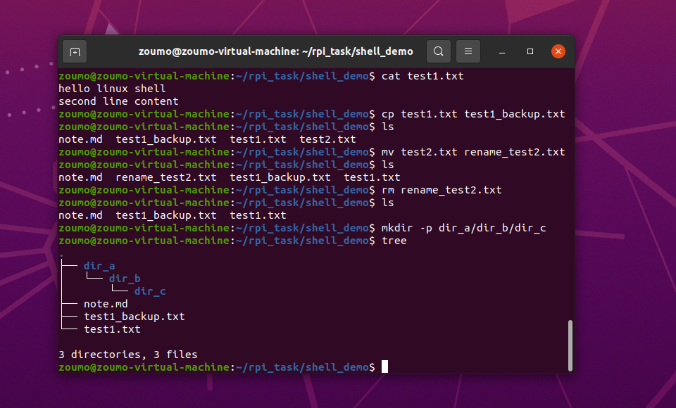
### 2.6 mv 文件移动 / 重命名
```bash
mv test2.txt test_new.txt
```
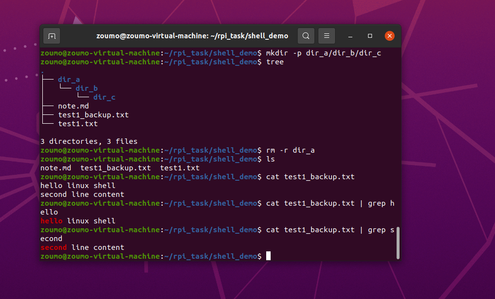
### 2.7 rm 删除文件
```bash
rm test_new.txt
```
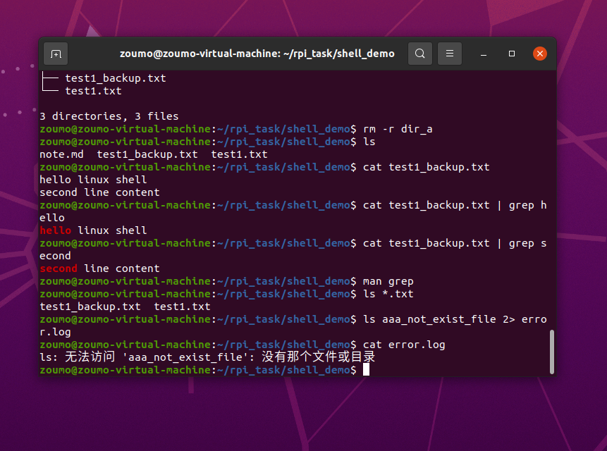
### 2.8 管道 | 和 grep 筛选
```bash
ls | grep demo
```
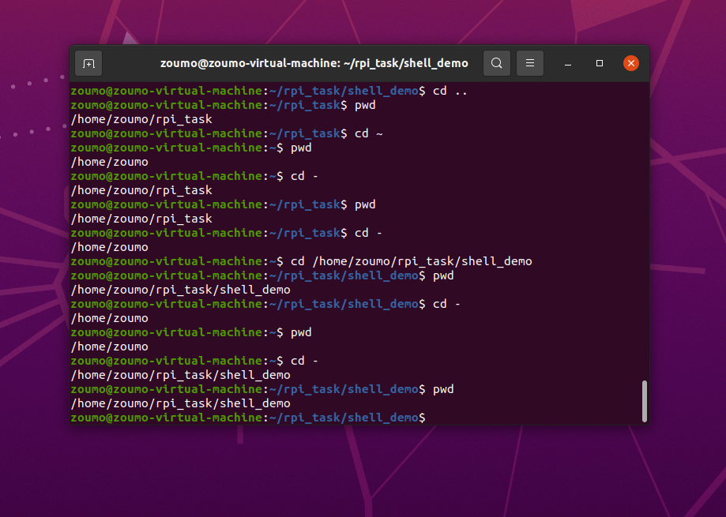
### 2.9 通配符 * 使用
```bash
ls *.txt
```
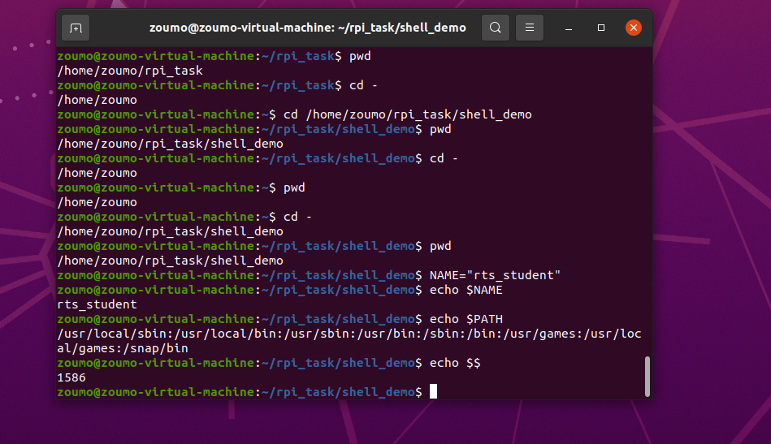
### 2.10 目录操作练习
```bash
cd -
```
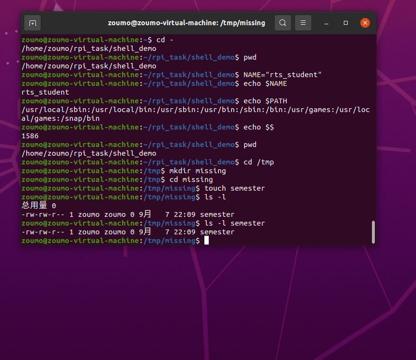
### 2.11 环境变量操作
```bash
export TEST=123
echo $TEST
```
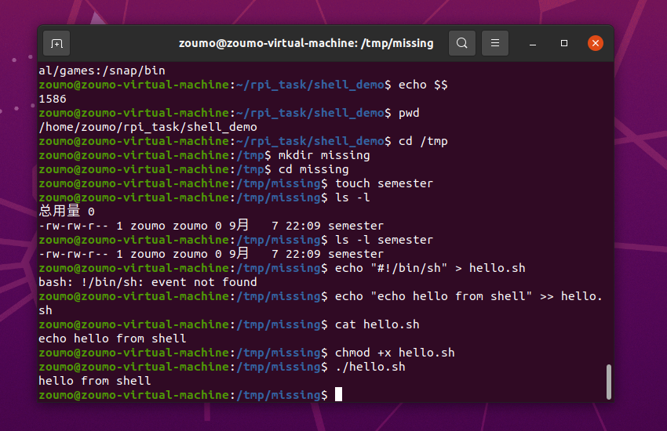
### 2.12 git 仓库初始化练习
```bash
git init
git config user.name "邹墨"
```
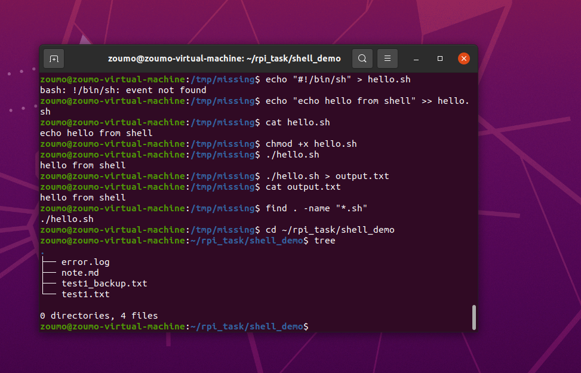
### 2.13 git add 添加暂存
```bash
git add task1_report.md
```
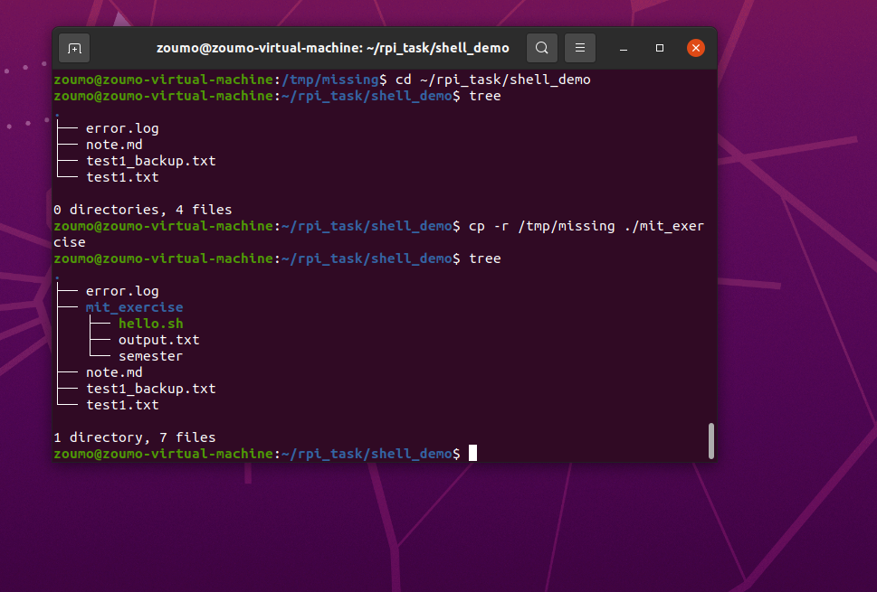
### 2.14 git commit 提交
```bash
git commit -m "add task1 report"
```
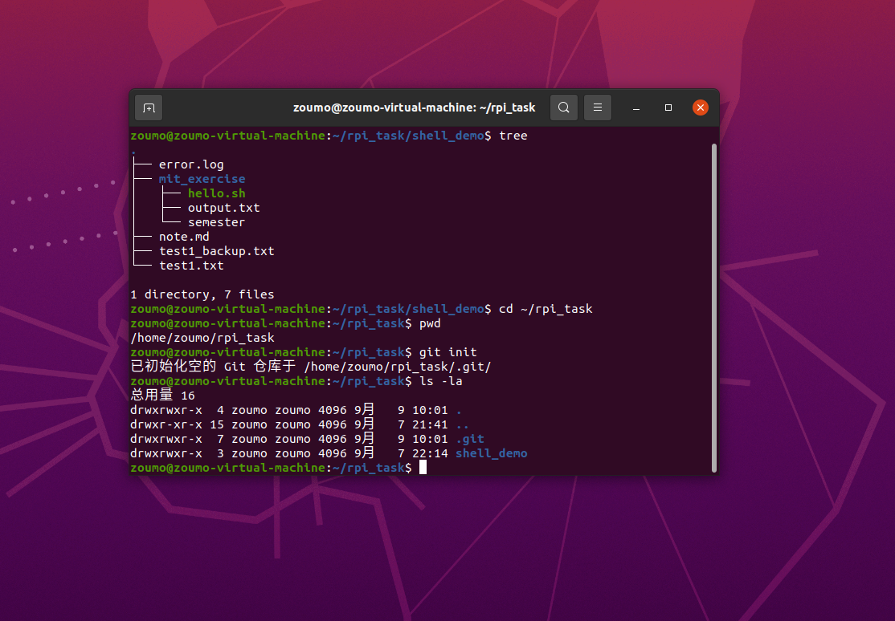
### 2.15 git 分支创建
```bash
git branch dev
git checkout dev
```
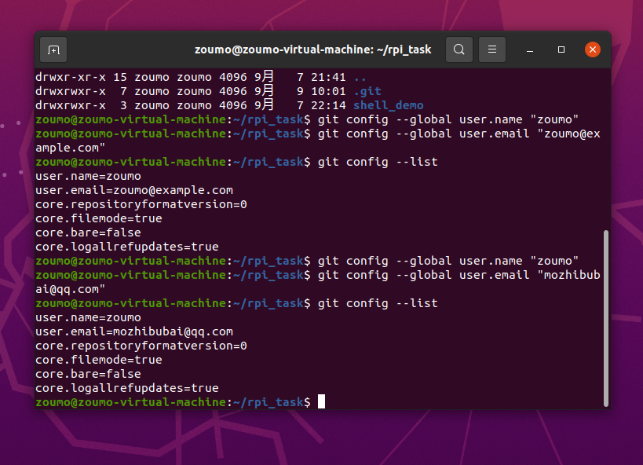
### 2.16 git 分支合并
```bash
git checkout master
git merge dev
```
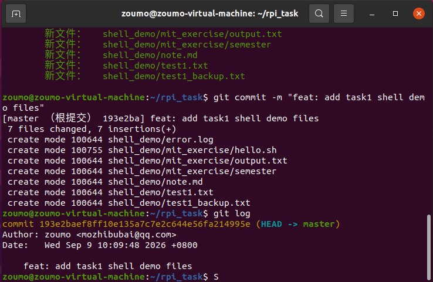
### 2.17 git 撤销修改
```bash
git checkout -- test.txt
```
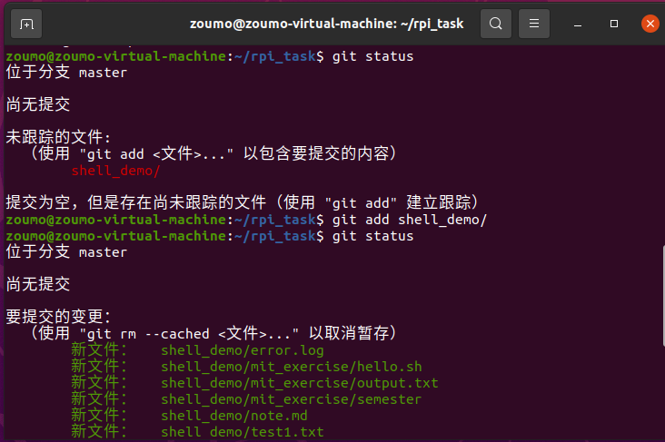
### 2.18 git log 查看提交记录
```bash
git log
```
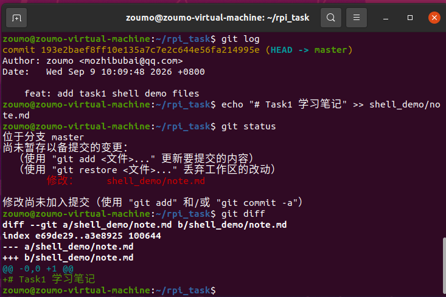
### 2.19 整体实验环境
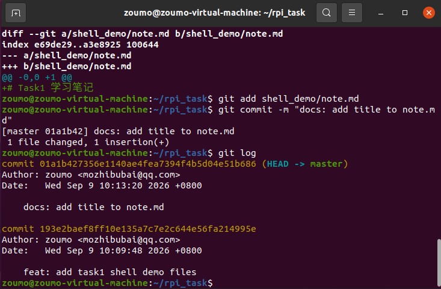
三、学习总结
本次实验在 Ubuntu 虚拟机中学习 Linux Shell 基础命令，掌握了目录跳转、文件创建复制删除、管道与文本筛选等基础操作。
同时学习 Git 版本控制工具，学会初始化仓库、提交文件、创建合并分支、撤销修改。
熟悉了命令行的工作逻辑，也学会使用 Markdown 编写实验报告，理解相对路径引用图片，为后续 RTS 视觉算法组任务打下基础。