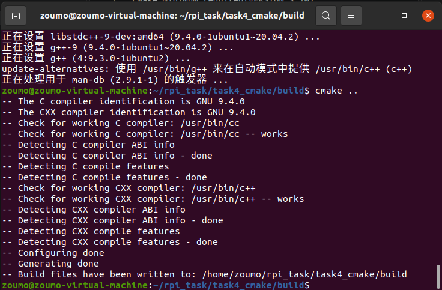
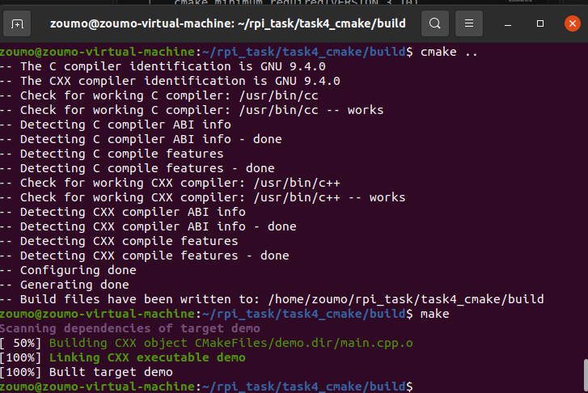
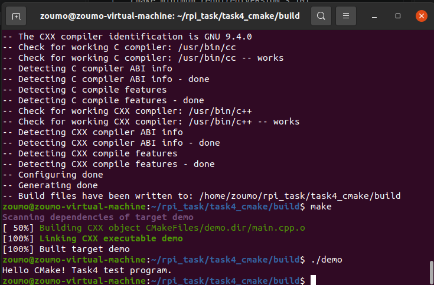

# Task4：学习使用 CMake

## 一、任务目标

本任务的目标是初步学习 CMake 的作用，完成基本的 `CMakeLists.txt` 编写，并在 Ubuntu 20.04 系统下完成一个 C++ 项目的编译与运行。

通过本任务，我完成了以下内容：

1. 编写了一个简单的 C++ 源文件 `main.cpp`；
2. 编写了对应的 `CMakeLists.txt`；
3. 使用 `cmake` 生成构建文件；
4. 使用 `make` 编译生成可执行文件；
5. 运行可执行文件并查看输出结果；
6. 记录编译、构建和运行过程中的截图。

---

## 二、实验环境

- 操作系统：Ubuntu 20.04
- 编译器：GNU g++ 9.4.0
- 构建工具：CMake
- 项目路径：`~/rpi_task/task4_cmake`
- 构建目录：`~/rpi_task/task4_cmake/build`
- 可执行文件：`demo`

---

## 三、项目目录结构

项目目录结构如下：

```text
task4_cmake/
├── CMakeLists.txt
├── main.cpp
├── build/
│   ├── CMakeFiles/
│   ├── Makefile
│   └── demo
└── images/
    ├── cmake_config.png
    ├── make_build.png
    └── run_demo.png
```

其中：

- `main.cpp`：C++ 源代码文件；
- `CMakeLists.txt`：CMake 构建配置文件；
- `build/`：构建目录，用于存放 CMake 和 Make 生成的中间文件及可执行文件；
- `images/`：存放本任务运行过程截图。

---

## 四、代码文件与 CMakeLists 文件

### 1. main.cpp

```cpp
#include <iostream>

int main() {
    std::cout << "Hello CMake! Task4 test program." << std::endl;
    return 0;
}
```

### 2. CMakeLists.txt

```cmake
cmake_minimum_required(VERSION 3.10)

project(task4_cmake)

set(CMAKE_CXX_STANDARD 11)

add_executable(demo main.cpp)
```

### 3. 文件说明

- `cmake_minimum_required(VERSION 3.10)`：声明 CMake 最低版本要求；
- `project(task4_cmake)`：声明项目名称；
- `set(CMAKE_CXX_STANDARD 11)`：设置 C++ 标准为 C++11；
- `add_executable(demo main.cpp)`：使用 `main.cpp` 生成名为 `demo` 的可执行文件。

---

## 五、编译与运行过程

在终端中进入项目目录，并执行以下命令：

```bash
cd ~/rpi_task/task4_cmake
mkdir -p build
cd build
cmake ..
make
./demo
```

命令说明：

1. `cd ~/rpi_task/task4_cmake`：进入项目根目录；
2. `mkdir -p build`：创建构建目录；
3. `cd build`：进入构建目录；
4. `cmake ..`：根据上一级目录中的 `CMakeLists.txt` 生成构建文件；
5. `make`：根据生成的 Makefile 编译项目；
6. `./demo`：运行生成的可执行文件。

---

## 六、运行效果截图

### 1. CMake 配置成功

执行 `cmake ..` 后，CMake 成功检测到 C 和 C++ 编译器，并生成构建文件。



从截图中可以看到：

- C 编译器为 GNU 9.4.0；
- CXX 编译器为 GNU 9.4.0；
- 配置完成；
- 构建文件已写入 `/home/zoumo/rpi_task/task4_cmake/build`。

---

### 2. make 编译成功

执行 `make` 后，项目成功编译并链接生成可执行文件 `demo`。



从截图中可以看到：

- 正在构建 CXX 对象 `CMakeFiles/demo.dir/main.cpp.o`；
- 正在链接 CXX 可执行文件 `demo`；
- 最终输出 `[100%] Built target demo`。

---

### 3. 运行 demo

执行 `./demo` 后，程序成功运行并输出预期内容。



输出结果为：

```text
Hello CMake! Task4 test program.
```

---

## 七、实现过程解释

本任务的核心是理解 CMake 在 C/C++ 项目构建中的作用。

传统编译方式通常需要手动输入类似下面的命令：

```bash
g++ main.cpp -o demo
```

这种方式在小型项目中可以使用，但当项目文件增多、依赖变复杂、需要跨平台构建时，手动编译会变得非常麻烦。

CMake 的作用是：

1. 通过 `CMakeLists.txt` 描述项目结构；
2. 自动生成对应平台的构建文件；
3. 在 Linux 下生成 Makefile；
4. 再通过 `make` 完成编译和链接。

本任务中，我采用了“源码目录与构建目录分离”的方式，即在 `build/` 目录中执行 `cmake ..` 和 `make`。这样做的好处是：

- 不污染源代码目录；
- 中间文件和可执行文件集中存放在 `build/` 中；
- 删除构建结果时只需要删除 `build/` 目录即可；
- 更符合实际 C/C++ 项目的构建习惯。

通过本任务，我掌握了：

- `CMakeLists.txt` 的基本写法；
- `cmake ..` 生成构建文件；
- `make` 编译项目；
- `./demo` 运行可执行文件；
- 使用构建目录进行 out-of-source build。

---

## 八、总结

本任务完成了 CMake 的基本学习和使用。我编写了一个简单的 C++ 程序，并通过 `CMakeLists.txt` 配置项目，最终在 Ubuntu 20.04 下使用 `cmake` 和 `make` 成功编译并运行了程序。

运行结果符合预期，输出：

```text
Hello CMake! Task4 test program.
```

通过该任务，我对 C/C++ 项目的构建流程有了初步认识，也为后续学习 OpenCV、ROS 等更复杂的项目构建打下了基础。